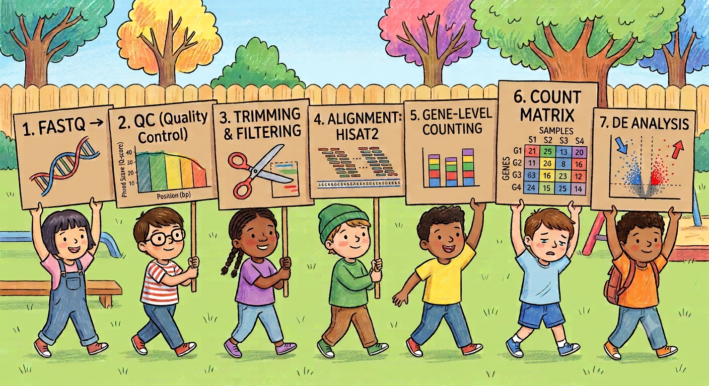

# Welcome to my Bulk RNA-seq Tutorial

*Work in progress*

In this tutorial, you will find a step-by-step protocol for achieving a reliable, simple, and reproducible bulk RNA-seq analysis, using **Bash**, **Nextflow**, and **R**. Designed for teaching purposes with real public data.  
  
The tutorial covers the following workflow steps:

- **Data acquisition** from NCBI SRA using the SRA Toolkit
- **Folder structure** setup
- **Secondary analysis** using Bash (**Part I**) and Nextflow (**Part II**) scripting, including:
    - Preprocessing: QC, trimming, post-trimming QC, and duplicate marking
    - Alignment (`HISAT2`) & Mark duplicates (`Picard`)
    - Raw count table generation per sample (`featureCounts`)
    - Visualisation (IGV)
- **Tertiary analysis** (RStudio):
    - Count matrix generation
    - DESeq2 transformation
    - PCA
    - Volcano and heatmap plots

The tutorial starts with three dataset samples, each representing one specific experimental group, from the study [DOI: 10.1038/s41467-018-07329-0](https://www.nature.com/articles/s41467-018-07329-0). Each dataset consists of paired-end FASTQ files (R1 and R2), which are used for the secondary analysis. For the tertiary analysis, a larger set of raw counts from more samples per experimental group from the same study is used to enable DESeq2 to normalise and calculate differential expression (DE).

> [!IMPORTANT]  
> **DESeq2** requires biological replicates to estimate dispersion. Analyzing 1 sample per condition (n=1) is statistically invalid for differential expression. The 3 samples in **Part I** are strictly for demonstrating the QC, trimming, alignment, and counting pipeline (due to file size limits). The actual DE analysis uses a separate, larger count matrix (included in the repo) with at least 3 biological replicates per group.

The purpose of this tutorial is educational and to promote reproducibility.

## 🔬 Workflow Overview
Overview of the bulk RNAseq pipeline in this repository.

  

- *Image generated in collaboration with Gemini (Google AI) via iterative prompting.*

---

## Tutorial structure

### 1️⃣ Part I – Preparation & setup  

1. Folder structure  
2. Finding an open dataset project   
3. Downloading paired-end reads datasets by **SRA Toolkit**   
4. Downloading pre-built reference genome indexes from HISAT2 (e.g., *Homo sapiens* GRCh38/hg38)
5. Conda environments

➡️ **Start here:**  
👉 [Part I – Preparation & setup](README_Part1_setup_bulkrnaseq.md)

---

---

## 🧪 Tested Environment

- macOS (Intel)
- 8 GB RAM
- Free space: < 40GB
- macOS Big Sur 11.7.11 (Intel)
- Conda-based installation

> [!DISCLAIMER]  
> ≥ 16 GB RAM (or even 32 GB) would be recommended for a full-scale datasets analysis. An 8 GB RAM laptop may suffice only for a small test files such as for this tutorial)

This repository is intended for **educational and research purposes only**.  
It is **not validated for clinical diagnostic use** and should not be used for medical decision-making.

All analyses are performed on publicly available research datasets.

---

## 🔎 Third-Party Tools & Resources

This tutorial uses and displays output or screenshots generated from the following tools and databases:

- Integrative Genomics Viewer (IGV, Broad Institute)
- FastQC
- MultiQC
- NCBI Sequence Read Archive (SRA)

All trademarks, software, and database contents belong to their respective owners.  
Screenshots and outputs are shown for educational and demonstration purposes only.

---

## 📜 License

© 2026 **bioinfo-frano**

This project is licensed under the **MIT License**. See the full license [here](LICENSE).
