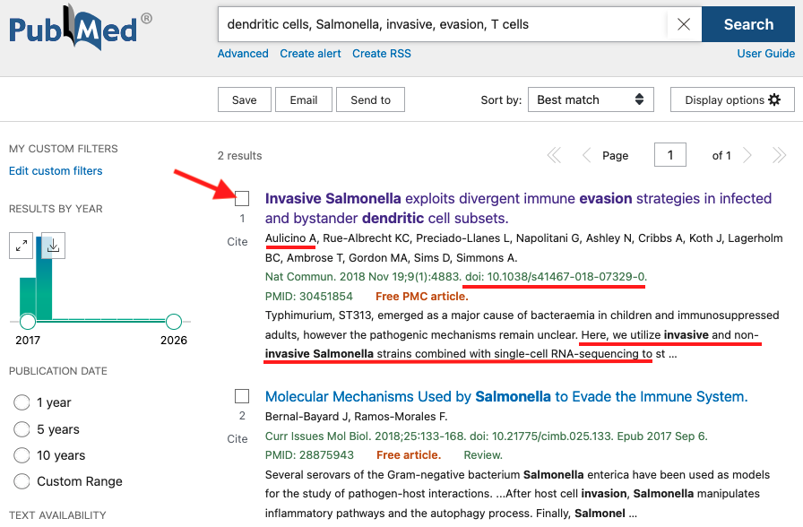
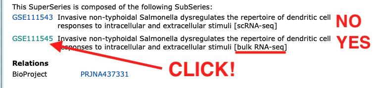
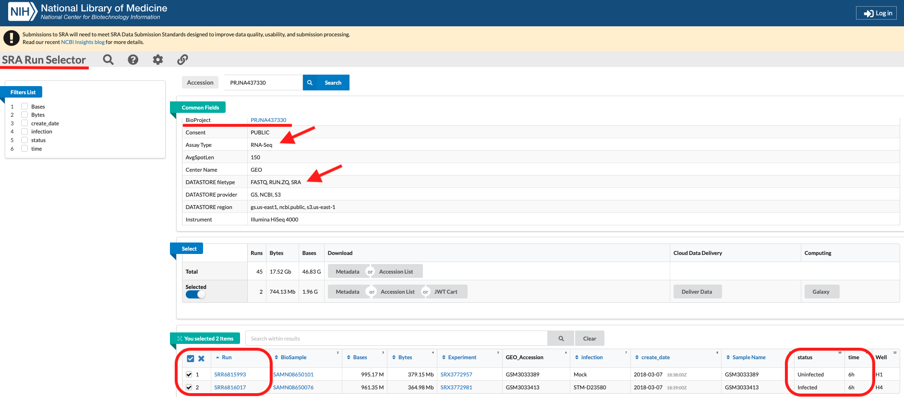

# Part I – Setup & data preparation

## Table of Contents

- [Introduction](#introduction)
- [Creating the computing environment for bulk RNA-seq analysis](#creating-the-computing-environment-for-bulk-rna-seq-analysis)  
    - [I. Create a folder structure](#i-create-a-folder-structure)  
    - [II. Find & download paired-end RNA-seq datasets](#ii-find--download-paired-end-rna-seq-datasets)  
    - [III. Download a pre-built HISAT2 genome index](#iii-download-a-pre-built-hisat2-genome-index)  
    - [IV. Create a Conda environment](#iv-create-a-conda-environment)  
    - [V. Create a BED12 file](#v-create-a-bed12-file)  
    - [VI. Final folder structure: before starting bulk RNA-seq analysis](#vi-final-folder-structure-before-starting-bulk-rna-seq-analysis)

## Introduction

Analysing transcriptomic datasets independently can be quite difficult if you don't have the proper guidance and, importantly, enough patience, time, and computational resources. At the end, you would have to send your datasets to an external bioinformatician or try other options all of which may involve additional costs. This is the logical solution when the statistics, tables and plots are urgently needed for the submission of scientific manuscripts or when preparing seminars.  
The purpose of this tutorial is to show that you can independently analyse your data using a personal computer (e.g., laptop) or workstation, which has limited computational resources.  
For the sake of learning, how to analyse your RNA-seq datasets, ideally, you should have some basic knowledge on command line, bash scripting, R programming, and python. However, if you don't have it, don't worry, **learn by doing!**

I would strongly suggest the following tutorials, so that you train yourself in these topics.
  
- [Learn Mac Terminal Basics - macmostvideo - YouTube](https://www.youtube.com/watch?v=ZkoEHvG3GI8)   
- [Command Line Basics for Beginners - Full Course - freeCodeCamp.org - YouTube](https://www.youtube.com/watch?v=mABpAI-pCw0)    
- [MASTERING Command Prompt Basics! | Tutorial (for Windows) - Skill Foundry - YouTube](https://www.youtube.com/watch?v=QBWX_4ho8D4)   
- [Bash Scripting Tutorial for Beginners  - TechWorld with Nana - YouTube](https://www.youtube.com/watch?v=PNhq_4d-5ek)   

Optional, but highly recommended too:   
  
- [R programming in one hour - a crash course for beginners - R Programming 101 - YouTube](https://www.youtube.com/watch?v=eR-XRSKsuR4&t=176s)   
- [Python Full Course for Beginners - Programming with Mosh - YouTube](https://www.youtube.com/watch?v=K5KVEU3aaeQ)   
  
> [!NOTE]  
> This guide was developed and tested on macOS running on Intel processors. Users on Apple Silicon (M1/M2/…/M5) or Linux systems may need to adapt certain steps.
  
<br> 

> [!IMPORTANT]
> **Conda prerequisites:**   
> This guide assumes that Miniconda3 is already installed on your computer. If not, please consult the official [documentation](https://docs.conda.io/projects/conda/en/stable/index.html) or watch this [YouTube](https://www.youtube.com/watch?v=hDGSZMLS5F4&t=67s) video.  
> When Miniconda is already installed, you should see the `(base)` environment activated in your Terminal.
  
<br>    

> [!IMPORTANT]
> **For Windows Users**: This tutorial relies on a Linux environment. If you are using Windows, the recommended approach is to install **Windows Subsystem for Linux (WSL2) with Ubuntu** to follow along with this tutorial. Once you open the WSL2 Ubuntu terminal on Windows, all steps from installing Miniconda (**Linux version**), creating conda environments, to running the bash scripts and Nextflow pipelines, must be performed within your WSL2 Ubuntu terminal.  
>  
>  WSL2 provides a genuine Linux environment inside Windows, ensuring compatibility with Conda, Bash scripts, bioinformatics software, and Nextflow workflows used throughout this tutorial.  
>
> Please, watch this [YouTube](https://www.youtube.com/watch?v=1XuoUlaIEFo) video to learn how to install **WSL2** on your Windows. >
> Alternatives such as **Git Bash** or **Cygwin** may work for some basic commands, but **they are not recommended** for running the complete pipelines described in this tutorial.  
>  
> Once you have completed the **WSL2** installation, you can continue following this tutorial.  

<br>  
  
Before starting, I would also recommend you to read the [Part I - Preparation & setup -  Introduction](https://github.com/bioinfo-frano/NGS_Workflow_Tutorial/blob/main/README_Part1-3_setup.md), where you can read a bit more about cloud computing alternatives and on what **FASTQ** files are.

With that foundational knowledge in mind, let's now set up our local environment for the actual analysis.  
  
From all analyses in this tutorial, the **alignment** is the most **computationally demanding** step. Therefore, since we are limited in terms of computational power, this tutorial will provide pipelines for the analysis of small numbers of RNA datasets that can be processed comfortably on standard workstations or laptops. Later on, when working in **R**, it will be possible to expand the number of RNA datasets by directly downloading raw counts, skipping all the preprocessing and alignment steps. Let's start.


## Creating the computing environment for bulk RNA-seq analysis

I.	Create a folder structure  

II.	Find & download paired-end RNA-seq datasets from a published scientific paper  

III. Download pre-built HISAT2 genome indexes (e.g., *Homo sapiens* GRCh38/hg38)  

IV.	Create conda environment `RNA1`  

V. Create a BED12 file   
  

## I. Create a folder structure  

All FASTQ files, reference genome indexes and scripts should be organised into specific folders. Below is a recommended folder structure:

```bash
Bulk_rnaseq/
├── data
├── reference
│   └── intervals
└── scripts
```

Multiple samples can be processed by creating one directory per SRA accession under `data/`.

In Terminal, create all directories at once:

```bash
mkdir -p Bulk_rnaseq/{data,scripts,reference/intervals}  
```

## II. Find & download paired-end RNA-seq datasets 

### 1. Finding a bulk RNA-seq dataset in PubMed

- **PubMed keywords**: dendritic cells, Salmonella, invasive, evasion, T cells
- **Title**: Invasive Salmonella exploits divergent immune evasion strategies in infected and bystander dendritic cell subsets
- [DOI: 10.1038/s41467-018-07329-0](https://www.nature.com/articles/s41467-018-07329-0)

  


- **Scientific question/hypothesis**: DCs differentially respond to genetically similar S. typhimurium strains
- **Scientific goal**: to survey the transcriptome of DCs challenged with invasive or non-invasive Salmonella
- **Method**: scRNA-seq complemented by bulk RNA-seq for population-level transcriptional profiling
- **Conclusion**: "… these observations contribute to a better understanding of the pathogenesis and dissemination of invasive Salmonelosis"
- **Data availability**: Gene Expression Omnibus (GEO): 
  - GEO accession: [**GSE111546**](https://www.ncbi.nlm.nih.gov/geo/query/acc.cgi?acc=GSE111546)
  - BioProject: [**PRJNA437330**](https://www.ncbi.nlm.nih.gov/bioproject/PRJNA437330)  
  
---

### 2. Select the datasets

2.1. Go to GEO accession: [**GSE111546**](https://www.ncbi.nlm.nih.gov/geo/query/acc.cgi?acc=GSE111546)  

   
   

2.2. Click on    
  
This will send you to the **SRA Run Selector**, BioProject **PRJNA437330**.  
Note down the SRA Runs:  
- `SRR6815993` (status: Uninfected; time: 6h)   
- `SRR6816017` (status: Infected  ; time: 6h)   
  
### 3. Create a Bash script to download the samples using **SRA Toolkit**
  
3.1. Go to Terminal, navigate to `Bulk_rnaseq/data`  

3.2. Create the file `sra_PRJNA437330.sh`. You can use:
  - `nano` or any script/text editor (e.g. Atom, Sublime)
  - `touch`.

3.3. Grant execute permissions:

```bash
cd Bulk_rnaseq/data
touch sra_PRJNA437330.sh
chmod u+x sra_PRJNA437330.sh
```
  
3.4. Activate conda `sra`.  

```bash
conda activate sra
```
You should see `(sra)` appear followed by the user name and directory.  

> [!IMPORTANT]  
> If you don't have installed the conda environment `sra`, which contains the SRA Toolkit and other dependencies,  
then install it here 👉 [Part I - Preparation & setup - Find & download small-sized FASTQ datasets for cancer gene panels](https://github.com/bioinfo-frano/NGS_Workflow_Tutorial/blob/main/README_Part1-3_setup.md)

3.3. Open `sra_PRJNA437330.sh` and copy/paste the bash script here below, which includes in this order:

- prefetch  
- vdb-validate  
- fasterq-dump  

```bash
#!/bin/bash

set -euo pipefail

DATASETS=(SRR6815993 SRR6816017)

for DATASET in "${DATASETS[@]}"; do
  echo
  echo "Processing dataset: $DATASET"
  echo "Downloading '$DATASET' with prefetch..."
  prefetch "$DATASET"
  echo "Validating integrity of dataset: $DATASET"
  vdb-validate "$DATASET" || { echo "Validation failed for $DATASET"; exit 1; }

  echo "Validation passed"

  fasterq-dump "$DATASET" \
  --split-files \
  --threads 4 \
  --outdir PRJNA437330/"$DATASET"/raw_fastq

  echo "Dataset $DATASET downloaded successfully to $PWD"
  echo "Removing $DATASET"
  rm -rf "$DATASET"
  echo "Compressing"
  gzip PRJNA437330/"$DATASET"/raw_fastq/*.fastq
  echo "Compression of $DATASET done!"

done

```

---


## III. Download a pre-built HISAT2 genome index  

The reference indexes have:  

- the DNA genome sequence  
- splice-site information  
- exon information  
   
The **genome_tran** indexes were built using both the reference genome sequence and transcript annotations, allowing HISAT2 to perform splice-aware alignment.

1. **Setup directory**:

```bash
# Navigate to your project reference directory
mkdir -p ~/Bulk_rnaseq/reference/hisat2_index
cd ~/Bulk_rnaseq/reference/hisat2_index
```

2. Download and extract indexes:

Go to: <http://daehwankimlab.github.io/hisat2/download/#h-sapiens>

Copy link “***genome_tran***” → grch38_tran.tar.gz

Download the HISAT2 indexes using `wget` followed by `tar` decompression

```bash
# Download the compressed index folder
wget -nc https://genome-idx.s3.amazonaws.com/hisat/grch38_tran.tar.gz

# 2. Decompress AND extract the archive
tar -zxf grch38_tran.tar.gz
```
sra_PRJNA437330.sh
Expected output:

```bash
Bulk_rnaseq/
├── data
│   ├── sra_PRJNA437330.sh
│   └── PRJNA437330
│       ├── SRR6815993
│       │   └── raw_fastq
│       │       ├── SRR6815993_1.fastq.gz
│       │       └── SRR6815993_2.fastq.gz
│       └── SRR6816017
│           └── raw_fastq
│               ├── SRR6816017_1.fastq.gz
│               └── SRR6816017_2.fastq.gz
├── reference
│   ├── hisat2_index
│   │   ├── grch38_tran
│   │   │   ├── genome_tran.1.ht2
│   │   │   ├── genome_tran.2.ht2
│   │   │   ├── genome_tran.3.ht2
│   │   │   ├── genome_tran.4.ht2
│   │   │   ├── genome_tran.5.ht2
│   │   │   ├── genome_tran.6.ht2
│   │   │   ├── genome_tran.7.ht2
│   │   │   ├── genome_tran.8.ht2
│   │   │   └── make_grch38_tran.sh
│   │   └── grch38_tran.tar.gz
│   └── intervals
└── scripts
```

> [!IMPORTANT]  
> In the HISAT2 website, choose the option **genome_tran** → `grch38_tran.tar.gz` because it has Genome + transcript annotations (exons + splice junctions). This is the recommended index for RNA‑seq, because HISAT2 can use known splice sites to improve alignment accuracy.  
Other alteratives such as **genome** and **genome_snp** are used when you **don't** need splice‑aware improvements from transcript annotations and when you consider known human SNPs during alignment, respectively.  
The alternative **genome_snp_tran** is when you want both variant‑aware mapping and splice‑aware mapping. It's substantially larger and might be unnecessary for this bulk RNA-seq workflow.  
The indexes **genome_rep(above 2.2.0)** and **genome_snp_rep(above 2.2.0)** correspond to studies nvolving repetitive elements (TEs, LINEs, SINEs) and Genome + SNPs + repeat annotations, respectively.

  
> [!NOTE]  
> Building a human HISAT2 index from scratch can take considerable time and disk space, so we use the pre-built indexes provided by the HISAT2 developers.
  
---

## IV. Create a Conda environment

### 1. Create `.yml` file with all dependencies for conda `RNA1` environment. Use `touch` or script/text editor  

1.1. Save it as: `RNA1_environment.yml`  
1.2. Save it in path: `~/Bulk_rnaseq/scripts`  

```yml
name: RNA1

channels:
  - conda-forge
  - bioconda
  - defaults

dependencies:
  - python=3.11
  
  # Pipeline engine
  - nextflow=25.10.4

  # QC
  - fastqc=0.12.1
  - multiqc=1.28

  # Trimming
  - cutadapt=5.2

  # Alignment
  - star=2.7.11b
  - hisat2=2.2.1
  - samtools=1.22.1
  
  # Duplicate marking
  - picard=3.4.0

  # Quantification
  - subread=2.1.1
  - salmon=1.10.3
  - kallisto=0.51.1
  
  # BED12 file generation
  - ucsc-gtftogenepred
  - ucsc-genepredtobed
  - rseqc
  - bedops

  # Annotation
  - gffread=0.12.7
  - biopython=1.85

  # Utilities
  - pigz
  - pbzip2
  - wget
  - curl
```

### 2. Create `RNA1` environment

2.1. Activate `base` Conda environment   
2.1. Navigate to `~/Bulk_rnaseq/scripts`  
2.2. Run `conda env create` using the `.yml`:  

```bash
cd ~/Bulk_rnaseq/scripts

conda env create -f RNA1_environment.yml
```

Expected output:

```bash
Downloading and Extracting Packages:
                                                                                                                                                                                     
Preparing transaction: done                      
Verifying transaction: done                                
Executing transaction: done     
#                           
# To activate this environment, use                                    
#            
#     $ conda activate RNA1       
#                       
# To deactivate an active environment, use        
#                     
#     $ conda deactivate  
```

### 3. Verify `RNA1`

3.1. Activate `RNA1`

```bash
conda activate RNA1

conda list

# Verify installations
fastqc --version
multiqc --version
cutadapt --version
STAR --version
hisat2 --version
samtools --version
featureCounts -v
infer_experiment.py --help   # from rseqc
gtfToGenePred                # from ucsc-gtftogenepred
genePredToBed                # from ucsc-genepredtobed
```

---

## V. Create a BED12 file

A **BED12** file is a 12-column tab-delimited annotation file required by **RSeQC** (`infer_experiment.py`) to determine library **strandedness**. Once strandedness has been identified, the appropriate parameter can be supplied to `featureCounts` during read quantification for the generation of the **raw count matrix**.  
  
The **BED12** file derives from the `gencode.v38.annotation.gtf.gz` GTF file.

1. Download the GTF file into `Bulk_rnaseq/reference/intervals`

Go to [**GENCODE**](https://www.gencodegenes.org/human/release_38.html)  
  
Download GTF: Regions: CHR → **This is the main annotation file for most users**  

On **CHR GTF**, right click on GTF and copy the link.  

Navigate to `Bulk_rnaseq/reference/intervals` and download there the GTF file using `wget`  

```bash
# Go to:
cd ~/Bulk_rnaseq/reference/intervals
# Download GTF
wget https://ftp.ebi.ac.uk/pub/databases/gencode/Gencode_human/release_38/gencode.v38.annotation.gtf.gz
```

2. Create the **BED12** file

```bash
gtfToGenePred gencode.v38.annotation.gtf.gz gencode.v38.annotation.genepred
genePredToBed gencode.v38.annotation.genepred gencode.v38.annotation.bed
```

3. Verify **BED12** file  

```bash
cd ~/Bulk_rnaseq/reference/intervals

head -2 gencode.v38.annotation.bed

grep "chrM" gencode.v38.annotation.bed | head -2
grep "chrY" gencode.v38.annotation.bed | head -1
grep "chrX" gencode.v38.annotation.bed | head -1
```

Expected output:

```bash
chr1	11868	14409	ENST00000456328.2	0	+	14409	14409	0	3	359,109,1189,	0,744,1352,
chr1	12009	13670	ENST00000450305.2	0	+	13670	13670	0	6	48,49,85,78,154,218,	0,169,603,965,1211,1443,

chrM	576	647	ENST00000387314.1	0	+	647	647	0	1	71,	0,
chrM	647	1601	ENST00000389680.2	0	+	1601	1601	0	1	954,	0,
chrY	253742	255091	ENST00000431238.7_PAR_Y	0	+	255091	255091	0	2	104,155,	0,1194,
chrX	253742	255091	ENST00000431238.7	0	+	255091	255091	0	2	104,155,	0,1194,
```

> [!IMPORTANT]  
> It's advisable to have two versions of the **BED12** file: one with and the other without the prefix "**chr**". This is because the chromosome naming must match between the HISAT2 alignment file (`.bam`) and the annotation file (**BED12**). Also, the "chrM", "chrX" and "chrY" should change to "MT", "X" and "Y", respectively.  

4. Create a **BED12** file without the prefix "**chr**" and changing "chrM" to "MT"

4.1. Use `sed` command: replace ‘chrM’ to ‘MT’ and strip ‘chr’

```bash
sed -E 's/^chrM/MT/; s/^chr//' gencode.v38.annotation.bed > gencode.v38.annotation.nochr.bed
```

4.2. Verify the new BED12 `gencode.v38.annotation.nochr.bed`  

```bash
head -2 gencode.v38.annotation.nochr.bed
grep "^MT" gencode.v38.annotation.nochr.bed | head -2
grep "^Y" gencode.v38.annotation.nochr.bed | head -1
```

Expected output:

```bash
1	11868	14409	ENST00000456328.2	0	+	14409	14409	0	3	359,109,1189,	0,744,1352,
1	12009	13670	ENST00000450305.2	0	+	13670	13670	0	6	48,49,85,78,154,218,	0,169,603,965,1211,1443,
MT	576	647	ENST00000387314.1	0	+	647	647	0	1	71,	0,
MT	647	1601	ENST00000389680.2	0	+	1601	1601	0	1	954,	0,
Y	253742	255091	ENST00000431238.7_PAR_Y	0	+	255091	255091	0	2	104,155,	0,1194,
X	253742	255091	ENST00000431238.7	0	+	255091	255091	0	2	104,155,	0,1194,
```

> [!NOTE]  
> The **BED12** file will be used later in **Part II** of the tutorial to determine library strandedness before read quantification.  
  

---

## VI. Final folder structure: before starting bulk RNA-seq analysis

```bash
Bulk_rnaseq/
├── data
│   └── PRJNA437330
│       ├── SRR6815993
│       │   └── raw_fastq
│       │       └── SRR6815993_{1,2}.fastq.gz
│       └── SRR6816017
│           └── raw_fastq
│               └── SRR6816017_{1,2}.fastq.gz
├── reference
│   ├── hisat2_index
│   │   ├── grch38_tran
│   │   │   └── genome_tran.{1,2,3,4,5,6,7,8}.ht2
│   │   └── grch38_tran.tar.gz
│   └── intervals
│       ├── gencode.v38.annotation.gtf.gz
│       ├── gencode.v38.annotation.bed
│       └── gencode.v38.annotation.nochr.bed
└── scripts
    └── RNA1_environment.yml
```


---

If you have reached the end of **PART I**, I congratulate you!!  
Continue to the 👉 [Part II – Secondary analysis](README_Part2-3_secondary_bulkrnaseq.md), where you'll start with the preprocessing analysis to alignment till the generation of raw counts tables, using bash and nextflow scripting explained step-by-step.

Go back to the top of 👉 [Part I – Setup & data preparation](README_Part1-3_setup_bulkrnaseq.md#part-i--setup--data-preparation)

Go to the main page 👉 [Bulk RNA-seq Tutorial](README.md)