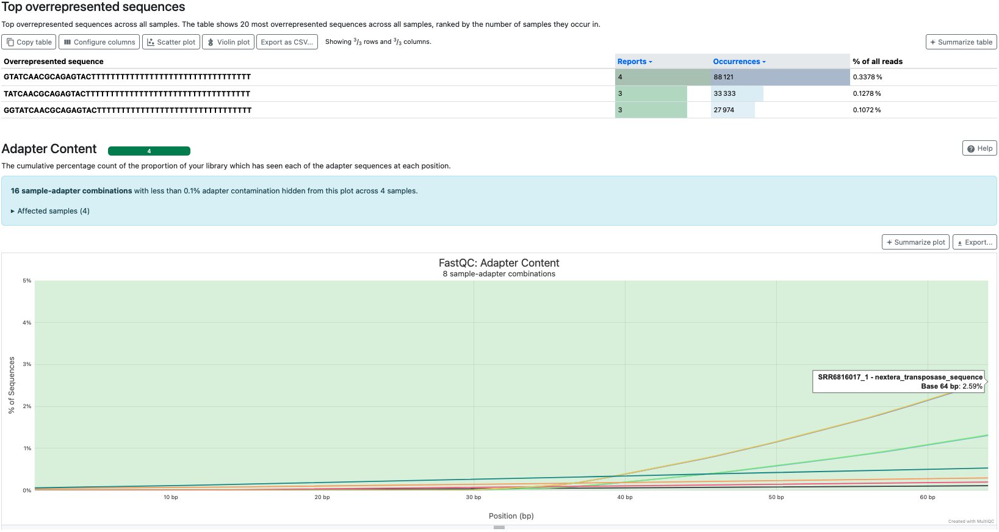
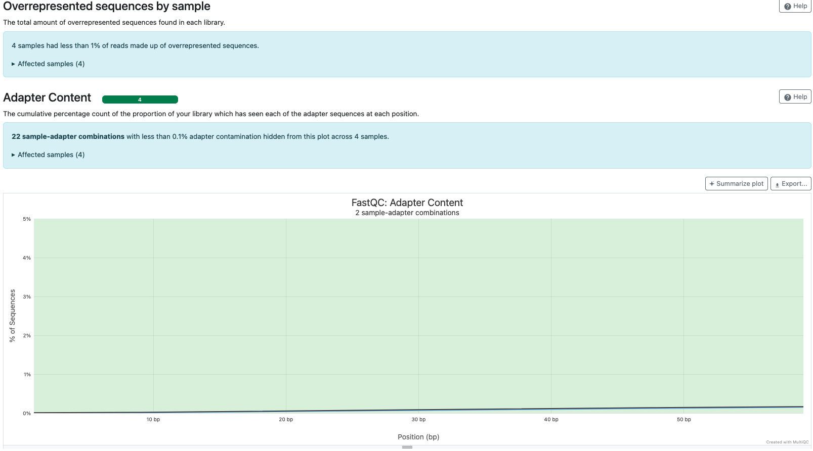
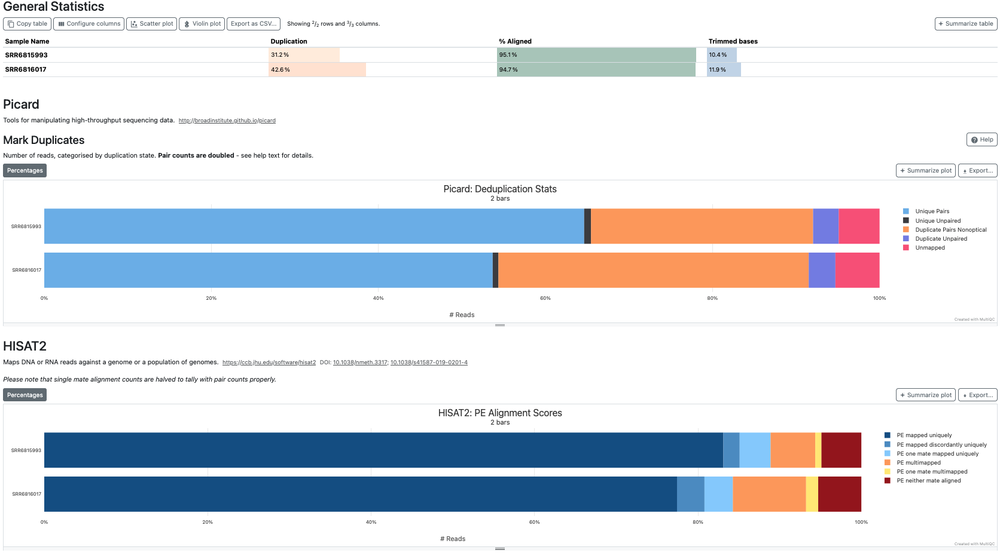
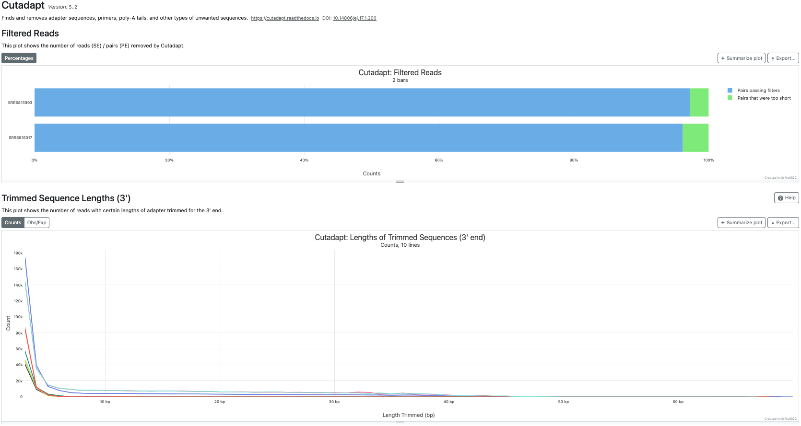

# Part II – Preprocessing & Secondary analysis

## Table of Contents

- [Introduction](#introduction)  
- [Pipeline overview](#pipeline-overview)  
- [Bash: Preprocessing](#bash-preprocessing)  
    - [1. QC report of raw datasets](#bash-preprocessing)  
    - [2. Trimming & filtering of reads + QC](#bash-preprocessing)  
- [Bash: Secondary analysis](#bash-alignment-and-mark-duplicates) 
    - [1. Alignment and mark duplicates](#bash-alignment-and-mark-duplicates)  
    - [2. Strandedness & Gene-level paired-end read quantification](#iii-bash-gene-level-paired-end-read-quantification)  
- [Nextflow: Preprocessing](#i-nextflow-preprocessing)  
- [Nextflow: Alignment and mark duplicates](#ii-nextflow-alignment-and-mark-duplicates)  
- [Nextflow: Gene-level paired-end read quantification](#iii-nextflow-gene-level-paired-end-read-quantification)  
- [Visualization](#visualization)


## Introduction

In this second part of bulk RNA-seq analysis, the two datasets downloaded in [Part I](README_Part1-3_setup_bulkrnaseq.md#part-i--setup--data-preparation) will be analysed with a series of bioinformatic tools within the conda `RNA1` environment. These tools are used in a predetermined order to evaluate and improve the quality of paired-reads of each dataset before the alignment-based quantification of gene expression takes place.  

In more details, **preprocessing** consists of quality control (QC) of raw reads and, depending on the results, the reads are trimmed and filtered by length and quality, according to their Phred score, to retain only high quality reads with minimal adapter contamination. After these QC steps, the **secondary analysis** starts with the mapping or alignment of the quality-improved datasets to the reference genome, followed by flagging of PCR duplicates and quantification of aligned pair-end reads.

The way to assign all these processes in a predetermined order, ensuring that each step in these processes is consistent across data and platforms is by drafting a ***bioinformatic pipeline***. Such pipelines utilize a programming or workflow language, allowing these processes to be portable, (if possible) parallelizable, consistent, and interoperable. These pipelines can be implemented using a variety of workflow systems, for example:

- **Bash**: simple, transparent, ideal for small workflows. More details:  
    - [How to write a bash script](https://www.youtube.com/watch?v=F-gskSl4pwQ)
    
- **Nextflow** & **Snakemake**: reproducible, scalable, cloud‑ready, container‑friendly. More details:  
    - [An introduction to Nextflow](https://www.youtube.com/watch?v=Gq1KiMJyNB4&t=1705s)  
    - [An introduction to Snakemake](https://www.youtube.com/watch?v=tUTcfoMQl98&t=136s)
- **CWL** (Common Workflow Language) — standardized, portable workflows across platforms. More details:  
    - <https://www.commonwl.org>

- **WDL** (Workflow Description Language) + **Cromwell** — used by Broad Institute; strong support for large genomics pipelines. More details:   
    - [Welcome to Cromwel - GitHub](https://github.com/broadinstitute/cromwell)  
    - [Intro to learning miniwdl for WDL](https://www.youtube.com/watch?v=w0IUd-x_9NU)

- **Galaxy**: *GUI‑based workflow system for non‑programmers who would like to learn bioinformatics. More details:  
    - [What is Galaxy?](https://www.youtube.com/watch?v=k6fTVIR4GME)  
    - ***GUI**: Graphical User Interface  

In this tutorial, we will implement the pipeline using **Bash** and **Nextflow**. **Bash** is ideal for learning the underlying commands, bioinformatics tools, and the logic of each step. **Nextflow** adds reproducibility, scalability, and the ability to resume failed jobs, which are valuable skills for real-world research.  

Both pipelines will cover **preprocessing** and **secondary analysis** of the datasets.  

> [!IMPORTANT]  
> **By the end of Part II, you will have:**
> - Cleaned, trimmed FASTQ files ready for alignment
> - Aligned reads in BAM format, sorted and indexed
> - Duplicate-marked BAM files for accurate quantification
> - A raw count matrix (`raw_counts.txt`) ready for differential expression analysis
> - Experience running the same pipeline with **Bash** and **Nextflow**

---

## Pipeline overview

The following table summarizes the steps, tools, inputs, and outputs, and description of the bulk RNA-seq pipeline implemented in this tutorial:


| **Step** | **Tool** | **Input** | **Output** | **Description** |
| :--- | :--- | :--- | :--- | :--- |
| 1. QC (Raw) | `FastQC` + `MultiQC` | Raw FASTQ files | QC reports (HTML + ZIP) | Assess raw read quality, GC content, adapter contamination, and overrepresented sequences |
| 2. Trimming | `Cutadapt` | Raw FASTQ files | Trimmed FASTQ (`.fastq.gz`) | Remove adapter sequences, trim low-quality bases, and filter reads by length |
| 3. QC (Trimmed) | `FastQC` + `MultiQC` | Trimmed FASTQ files | QC reports (HTML + ZIP) | Re-evaluate read quality after trimming to confirm improvement |
| 4. Alignment | `HISAT2` +<br>`samtools sort` | Trimmed FASTQ files | Sorted BAM (`.sorted.bam`) | Align trimmed reads to the reference genome (GRCh38) and sort the resulting BAM files by genomic coordinates (chr and position) |
| 5. Duplicate Marking | `Picard MarkDuplicates` | Sorted BAM | Dedup BAM (`.dedup.bam`) + metrics | Flag PCR duplicates in aligned BAM files (without removing them, as required for RNA-seq) |
| 5.5. BAM Indexing | `samtools index` | Dedup BAM (`.dedup.bam`) | BAM index file (`.dedup.bam.bai`) | Create an index for the deduplicated BAM file to enable fast random access for downstream tools and visualization |
| 6. Strandedness | `RSeQC (infer_experiment.py)` | Dedup BAM + BED12 | Strandedness report (`.txt`) | Determine library strandedness to set the correct `-s` parameter for accurate **gene-level** quantification |
| 7. Quantification | `featureCounts` | Dedup BAM + GTF | Raw count matrix (`raw_counts.txt`) | Count paired-end reads mapping to genes to generate a **gene-level** raw count matrix for DE analysis|
| 8. Post-Alignment QC | `RSeQC` + `MultiQC` | Dedup BAM + BED12 | QC reports + MultiQC summary | Assess alignment quality, read distribution, and splice junction annotation |
| 9. Visualization | `IGV` | Dedup BAM + BAI | Interactive genome browser view | Visualize aligned reads, splice junctions, and coverage across genomic regions |

---

## Bash: Preprocessing  

### 1. QC report of raw datasets: FastQC & MultiQC  

As shown in [Part I - Find & download paired-end RNA-seq datasets](README_Part1-3_setup_bulkrnaseq.md#part-i--setup--data-preparation), to develop a bash script, you have to create an executable `.sh` file and next copy/paste/save the bash script below into the `.sh` file. Then, run it from `~/Bulk_rnaseq/scripts`.
<br>
**Steps**:  
1. Navigate to `Bulk_rnaseq/scripts`  
2. Create `RNA1_01_bulkrnaseq_preprocessing.sh`  
3. Grant execute permissions  

```bash
# Run these commands one by one
cd path/to/Bulk_rnaseq/scripts
touch RNA1_01_bulkrnaseq_preprocessing.sh
chmod u+x RNA1_01_bulkrnaseq_preprocessing.sh
```

4. Open the `.sh`. Use a text/script editor, e.g. nano, vim, etc. and copy/paste/save the **bash script** below   

**Bash script: raw datasets QC**  

```bash
#!/bin/bash

set -euo pipefail

# Set variables as path
DATA_DIR="$1"               # /path/to/Bulk_rnaseq
PROJECT="PRJNA437330"
PROJECT_PATH="$DATA_DIR/data/$PROJECT"
THREADS=4
RESULTS="$DATA_DIR/results"
QC_DIR="$RESULTS/qc_raw"
QC_DIR_FASTQC="$QC_DIR/fastq_raw"
QC_DIR_MULTIQC="$QC_DIR/multiqc_raw"
QC_DIR_FASTQC_TRIM="$RESULTS/qc_trimmed/fastq_trimmed"
QC_DIR_MULTIQC_TRIM="$RESULTS/qc_trimmed/multiqc_trimmed"
RAW_FASTQ_DIR=$PROJECT_PATH/*/raw_fastq     # To expand the '*' (placeholder for "SRR..." datasets) do not use quotation marks
TRIMMED="$RESULTS/trimmed"
LOGS="$RESULTS/logs"


# ------- QC fastq files -------

# Create a QC folder for raw fastq files
mkdir -p "$QC_DIR_FASTQC"
mkdir -p "$QC_DIR_MULTIQC"

echo "####################"
echo "## Running FASTQC ##"
echo "####################"

for fastq in $RAW_FASTQ_DIR/*.fastq.gz; do
    fastqc \
        --threads "$THREADS" \
        --outdir "$QC_DIR_FASTQC" \
        "$fastq"
done

# MultiQC report from raw fastq files
  echo "#####################"
  echo "## Running MultiQC ##"
  echo "#####################"

multiqc \
  "$QC_DIR_FASTQC" \
  -o "$QC_DIR_MULTIQC"    


# ------- Trimming & filtering -------            # to be continue
```

5. Running the script: In `Bulk_rnaseq/scripts` run the `.sh` with the working directory `~/Bulk_rnaseq`

```bash
./RNA1_01_bulkrnaseq_preprocessing.sh /path/to/Bulk_rnaseq
```

<br>

> [!NOTE]  
> The line `DATA_DIR="$1"` at the top of the bash script indicates the script where the path to the project folder directory, in this case is `/path/to/Bulk_rnaseq`, is located. The `$1` is a **command‑line argument** that you must provide when running the script.  
>
> **This is important**: You cannot simply run `./RNA1_01_bulkrnaseq_preprocessing.sh` because the script expects you to **pass the path** as an argument.
> 
> **Correct usage**:
> ```bash
> ./RNA1_01_bulkrnaseq_preprocessing.sh /path/to/Bulk_rnaseq
> ```
>
> **Incorrect usage** (will fail):
> ```bash
> ./RNA1_01_bulkrnaseq_preprocessing.sh
> ```
>
> Replace `/path/to/Bulk_rnaseq` with the actual path to your project folder.

<br>

6. **Folder structure**: Output files from **raw datasets QC**. See `~Bulk_rnaseq/results/qc_raw`

```bash
Bulk_rnaseq/
├── data
│   ├── PRJNA437330
│   │   ├── SRR6815993
│   │   │   └── raw_fastq
│   │   │       ├── SRR6815993_1.fastq.gz
│   │   │       └── SRR6815993_2.fastq.gz
│   │   └── SRR6816017
│   │       └── raw_fastq
│   │           ├── SRR6816017_1.fastq.gz
│   │           └── SRR6816017_2.fastq.gz
│   └── sra_PRJNA437330.sh
├── reference
├── results
│   ├── qc_raw
│   │   ├── fastq_raw
│   │   │   ├── SRR6815993_{1,2}_fastqc.html
│   │   │   ├── SRR6815993_{1,2}_fastqc.zip
│   │   │   ├── SRR6816017_{1,2}_fastqc.html
│   │   │   ├── SRR6816017_{1,2}_fastqc.zip
│   │   └── multiqc_raw
│   │       ├── multiqc_data
│   │       └── multiqc_report.html
└── scripts
    └── RNA1_01_bulkrnaseq_preprocessing.sh
```

7. **FastQC** and **MultiQC** reports

**FastQC** reports, for both samples and for each R1 and R2, show:

- Sequence length of 75bp and zero sequences flagged as poor quality  
- Good **Per base sequence quality**, but the first 5bp show lower quality than the rest  
- Warning sign in **Per base sequence content**  
- Levels of **duplication** high
- There are **overrepresented sequences** and observed **adapter content**

<br>

**MultiQC** report:  
Since the quality of reads and bp is excellent, the most important issue are the overrepresented sequences and the adapter content 

<br>

   


### 2. Trimming & filtering of reads + QC: Cutadapt + FastQC & MultiQC

For the second part of the **preprocessing** bash script:  

1. Copy/paste/save the **trimming/filtering of reads** and **post trimming QC** part to the `RNA1_01_bulkrnaseq_preprocessing.sh` file  

**Bash script: Trimming/filtering + QC**  
  
```bash
# ------- Trimming & filtering -------

# Create a trimming folder
mkdir -p "$TRIMMED"
mkdir -p "$LOGS"

# For looping each sample (SRR accession), process both R1 and R2
for SAMPLE_DIR in $PROJECT_PATH/*; do
  # Extract the sample name from the directory path (e.g., SRR6815993). 'basename' strips directory path and returns only the last component
  SAMPLE=$(basename "$SAMPLE_DIR")

  echo "######################"
  echo "## Running Cutadapt ##"
  echo "## Sample: $SAMPLE  ##"
  echo "######################"

  echo "$SAMPLE_DIR"

  # Define input and output file paths
  R1_IN="$SAMPLE_DIR/raw_fastq/${SAMPLE}_1.fastq.gz"
  R2_IN="$SAMPLE_DIR/raw_fastq/${SAMPLE}_2.fastq.gz"
  R1_OUT="$TRIMMED/${SAMPLE}_R1.trimmed.fastq.gz"
  R2_OUT="$TRIMMED/${SAMPLE}_R2.trimmed.fastq.gz"

  cutadapt \
    -j "$THREADS" \
    -u 5 -U 5 \
    -q 24,24 \
    -m 30 \
    --poly-a \
    -a CTGTCTCTTATACACATCT \
    -A CTGTCTCTTATACACATCT \
    -b GTATCAACGCAGAGTACTTTTTTTTTTTTTTTTTTTTTTTTTTTTTTTTT \
    -b TATCAACGCAGAGTACTTTTTTTTTTTTTTTTTTTTTTTTTTTTTTTTTT \
    -b GGTATCAACGCAGAGTACTTTTTTTTTTTTTTTTTTTTTTTTTTTTTTTT \
    -o "$R1_OUT" \
    -p "$R2_OUT" \
    "$R1_IN" "$R2_IN" \
    > "$LOGS/cutadapt_${SAMPLE}.log" 2>&1

    echo "✅ Trimming complete for $SAMPLE"
    echo "   R1 output: $R1_OUT"
    echo "   R2 output: $R2_OUT"
    echo

done

# ------- QC fastq files -------

# Create a QC folder for raw fastq files
mkdir -p "$QC_DIR_FASTQC_TRIM"
mkdir -p "$QC_DIR_MULTIQC_TRIM"

# No looping for FASTQC this time because the trimmed files are all in $TRIMMED
echo "####################"
echo "## Running FASTQC ##"
echo "####################"

fastqc \
  --threads "$THREADS" \
  --outdir "$QC_DIR_FASTQC_TRIM" \
  $TRIMMED/*.trimmed.fastq.gz


# MultiQC report from raw fastq files
echo "#####################"
echo "## Running MultiQC ##"
echo "#####################"

multiqc \
  $QC_DIR_FASTQC_TRIM \
  -o $QC_DIR_MULTIQC_TRIM

```
<br>
 
 
> [!NOTE]  
> **How the for loop works**:
> 
> The `for` loop processes both samples (`SRR6815993` and `SRR6816017`) automatically. 
>
> There is no single correct way to write a `for` loop in Bash. You can implement it in different ways, as long as it correctly iterates over the input files.
>
> `SAMPLE_DIR` contains the full paths within `$PROJECT_PATH/*`, which are:
>
> - `path/to/Bulk_rnaseq/data/PRJNA437330/SRR6815993`  
> - `path/to/Bulk_rnaseq/data/PRJNA437330/SRR6816017`  
>
> `SAMPLE` contains only the **sample ID**, extracted from `SAMPLE_DIR` using the `basename` command:  
> - `SRR6815993`  
> - `SRR6816017`  
>
> **Cutadapt options used**:  
>
> `-a / -A`: Remove Illumina Nextera adapter sequences from Read 1 and Read 2.  
> `--poly-a`: Trim poly-A tails from Read 1 and poly-T heads from Read 2 after adapter trimming.  
> `-u / -U`: Remove the first 5 bases from Read 1 and Read 2 before quality trimming.  
> `-q 24,24`: Trim low-quality bases from both the 5′ and 3′ ends of Read 1 and Read 2 using a Phred quality cutoff of 24. Quality trimming is performed before adapter trimming.  
> `-m`: Discard reads shorter than the specified minimum length after trimming.  
> `"$LOGS/cutadapt_${SAMPLE}.log" 2>&1`: Redirect both the standard output (stdout) and standard error (stderr) to a single log file for each sample. During a successful run, the log mainly contains Cutadapt's processing summary; if any errors occur, they are written to the same file.  
>
> **Order of Cutadapt operations**: 
> 1. Remove the first 5 bases (`-u / -U`).
> 2. Perform quality trimming (`-q`).
> 3. Remove adapter sequences (`-a / -A`).
> 4. Trim poly-A tails (R1) and poly-T heads (R2) (`--poly-a`).
> 5. Discard reads shorter than 30 nt (`-m`).


2. **Folder structure**: Output files from trimmed datasets and post QC.  

See:
- `~/Bulk_rnaseq/results/qc_trimmed`  
- `~/Bulk_rnaseq/results/trimmed`  
- `~/Bulk_rnaseq/results/logs`
- `~/Bulk_rnaseq/scripts`

```bash
Bulk_rnaseq/
├── data
│   ├── PRJNA437330
│   │   ├── SRR6815993
│   │   │   └── raw_fastq
│   │   │       ├── SRR6815993_1.fastq.gz
│   │   │       └── SRR6815993_2.fastq.gz
│   │   └── SRR6816017
│   │       └── raw_fastq
│   │           ├── SRR6816017_1.fastq.gz
│   │           └── SRR6816017_2.fastq.gz
│   └── sra_PRJNA437330.sh
├── reference
├── results
│   ├── logs
│   │   ├── cutadapt_SRR6815993.log
│   │   └── cutadapt_SRR6816017.log
│   ├── qc_raw
│   ├── qc_trimmed
│   │   ├── fastq_trimmed
│   │   │   ├── SRR6815993_R1.trimmed_fastqc.{html,zip}
│   │   │   ├── SRR6815993_R2.trimmed_fastqc.{html,zip}
│   │   │   ├── SRR6816017_R1.trimmed_fastqc.{html,zip}
│   │   │   └── SRR6816017_R2.trimmed_fastqc.{html,zip}
│   │   └── multiqc_trimmed
│   │       ├── multiqc_data
│   │       └── multiqc_report.html
│   └── trimmed
│       ├── SRR6815993_R1.trimmed.fastq.gz
│       ├── SRR6815993_R2.trimmed.fastq.gz
│       ├── SRR6816017_R1.trimmed.fastq.gz
│       └── SRR6816017_R2.trimmed.fastq.gz
└── scripts
    └── RNA1_01_bulkrnaseq_preprocessing.sh

```

3. **FastQC** and **MultiQC** reports

**FastQC** reports after trimming and filtering of reads, for both samples and for each R1 and R2, show:

- Sequence length of 30 - 70bp and zero sequences flagged as poor quality  
- Improved **Per base sequence quality**
- Warning sign in **Per base sequence content**  
- Levels of **duplication** high
- Less than 1% of reads with **overrepresented sequences** and less than 0.1% with **adapter content**

<br>

**MultiQC** report:  

- **Sequence Length Distribution**: There's a wider range of sequence lengths; however, most of the reads are 70bp
- **Mean Quality Scores**: Quality of reads improved even more
- **Overrepresented sequences by sample** & **Adapter Content**: content of overrepresented sequences and adapters is almost negligible.  

<br>

   

---


## Bash: Secondary analysis

### 1. Alignment, mark duplicates and QC: HISAT2 + MarkDuplicates + MultiQC

1. Create another `.sh` script to perform read alignment with **HISAT2**, mark potential PCR duplicates, and generate a post-alignment QC report.

```bash
# Run these commands one by one
cd path/to/Bulk_rnaseq/scripts
touch RNA1_02_bulkrnaseq_alignment_markdup.sh
chmod u+x RNA1_02_bulkrnaseq_alignment_markdup.sh
```

2. Open the `.sh`. Use a text/script editor, e.g. nano, vim, etc. and copy/paste/save the **bash script** below   

**Bash script: Alignment + mark duplicates + QC**  

```bash
#!/bin/bash

set -euo pipefail

# Set variables as path
DATA_DIR="$1"               # /path/to/Bulk_rnaseq
PROJECT="PRJNA437330"
PROJECT_PATH="$DATA_DIR/data/$PROJECT"
THREADS=4
RESULTS="$DATA_DIR/results"
RAW_FASTQ_DIR=$PROJECT_PATH/*/raw_fastq     # To expand the '*' (placeholder for "SRR..." datasets) do not use quotation marks
TRIMMED="$RESULTS/trimmed"
LOGS="$RESULTS/logs"
HISAT2_INDEX="$DATA_DIR/reference/hisat2_index/grch38_tran"
ALIGNMENT="$RESULTS/alignment"
QC_POST_ALIGN="$RESULTS/qc_post_align"

# ------- Aligment: HISAT2 -------

# Create folders for alignment (in case they don't exist)
mkdir -p "$ALIGNMENT"
mkdir -p "$LOGS"

# Define sample IDs and names as indexed arrays (compatible with Bash 3.x)
SAMPLES=("SRR6815993" "SRR6816017")
SAMPLE_NAMES=("6h_Mock" "6h_STM-D23580_inv")

# For looping the alignment per sample
for i in "${!SAMPLES[@]}"; do
  SAMPLE_ID="${SAMPLES[$i]}"
  SAMPLE_NAME="${SAMPLE_NAMES[$i]}"

  # Input trimmed fastq files
  R1_TRIM="$TRIMMED/${SAMPLE_ID}_R1.trimmed.fastq.gz"
  R2_TRIM="$TRIMMED/${SAMPLE_ID}_R2.trimmed.fastq.gz"

  echo "########################"
  echo "## Running HISAT2     ##"
  echo "## Sample: $SAMPLE_ID ##"
  echo "########################"

  hisat2 \
    -x "$HISAT2_INDEX/genome_tran" \
    -1 "$R1_TRIM" \
    -2 "$R2_TRIM" \
    --rg-id "${SAMPLE_ID}" \
    --rg "SM:${SAMPLE_NAME}" \
    --rg "LB:RNAseq" \
    --rg "PL:ILLUMINA" \
    --rg "PU:HiSeq4000" \
    --new-summary \
    --summary-file "$LOGS/${SAMPLE_ID}.hisat2.log" \
    -p "$THREADS" \
  | samtools sort \
    -@ "$THREADS" \
    -m 500M \
    -o "$ALIGNMENT/${SAMPLE_ID}.sorted.bam"

    echo "✅ Alignment complete for $SAMPLE_ID"
    echo "Output: $ALIGNMENT/${SAMPLE_ID}.sorted.bam"
    echo

done

# ------- Mark duplicates: Picard -------

# For looping the Markduplicates per sample
for i in "${!SAMPLES[@]}"; do
  SAMPLE_ID="${SAMPLES[$i]}"

  echo "################################"
  echo "## Running MarkDuplicates     ##"
  echo "## Sample: $SAMPLE_ID         ##"
  echo "################################"

  picard MarkDuplicates \
    I="$ALIGNMENT/${SAMPLE_ID}.sorted.bam" \
    O="$ALIGNMENT/${SAMPLE_ID}.dedup.bam" \
    M="$LOGS/${SAMPLE_ID}_dedup_metrics.txt" \
    REMOVE_DUPLICATES=false \
    CREATE_INDEX=false \
    VALIDATION_STRINGENCY=SILENT

    echo "✅ Duplicate marking complete for $SAMPLE_ID"
    echo "Output: $ALIGNMENT/${SAMPLE_ID}.dedup.bam"
    echo "Metrics: $LOGS/${SAMPLE_ID}_dedup_metrics.txt"

    # Index the dedup BAM for IGV visualization
    echo "🔍 Indexing BAM file..."
    samtools index "$ALIGNMENT/${SAMPLE_ID}.dedup.bam"
    echo "✅ Indexing complete"

done

# ------- MultiQC Postalignment -------

mkdir -p "$QC_POST_ALIGN"

echo "################################"
echo "## Running MultiQC            ##"
echo "## Directory: $QC_POST_ALIGN  ##"
echo "################################"

multiqc \
  "$LOGS" \
  -o "$QC_POST_ALIGN"

```
    
<br>
 
 
> [!NOTE]  
> **How the alignment and mark duplicates loops work**:
>
> At this stage of the pipeline, the input files are the trimmed paired-end FASTQ files located in `~/Bulk_rnaseq/results/trimmed`   
>
> The `for` loop processes both samples (`SRR6815993` and `SRR6816017`) automatically. The script defines a list called `SAMPLES`, which stores the sequencing accession IDs. A second list, `SAMPLE_NAMES`, stores descriptive sample names that are added to the BAM file as **read group** (**RG**) metadata during alignment. During each iteration, the loop aligns one sample, adds the corresponding RG information, sorts the alignments with `samtools sort`, and saves a separate HISAT2 log file for that sample.
>
> Including **RG** information during alignment (by aligners such as **HISAT2**, **BWA-MEM**, and **STAR**), is considered a good practice because it allows downstream tools to distinguish sequencing libraries and samples. Then, **RG** provides info about:
>
> - Sample identity
> - Sequencing library
> - Platform informatio
> - Compatibility with downstream analysis tools
>
> A second `for` loop runs **Picard** `MarkDuplicates` on each sorted BAM file and flags those duplicated reads, generating a `.dedup.bam` file per sample, and one duplication metrics report `*_dedup_metrics.txt` per sample.  
>
> Duplicate reads are flagged, **NOT removed**, because option: `REMOVE_DUPLICATES=false`. This preserves all reads while allowing downstream tools to identify PCR duplicates if needed.
>
> Finally, each `.dedup.bam` file is indexed with `samtools index`, generating a corresponding `.dedup.bam.bai` file. The `.dedup.bam` and `.dedup.bam.bai` are required for efficient read alignment visualization with **IGV**.  

    
3. **Folder structure**: Output files alignment and post QC.  

See:
- `~/Bulk_rnaseq/results/alignment`  
- `~/Bulk_rnaseq/results/logs`  
- `~/Bulk_rnaseq/results/qc_post_align`
- `~/Bulk_rnaseq/scripts`

```bash
Bulk_rnaseq/
├── data
├── reference
├── results
│   ├── alignment
│   │   ├── SRR6815993.dedup.bam
│   │   ├── SRR6815993.dedup.bam.bai
│   │   ├── SRR6815993.sorted.bam
│   │   ├── SRR6815993_chr_prefix.txt
│   │   ├── SRR6816017.dedup.bam
│   │   ├── SRR6816017.dedup.bam.bai
│   │   ├── SRR6816017.sorted.bam
│   │   └── SRR6816017_chr_prefix.txt
│   ├── logs
│   │   ├── SRR6815993.hisat2.log
│   │   ├── SRR6815993_dedup_metrics.txt
│   │   ├── SRR6816017.hisat2.log
│   │   ├── SRR6816017_dedup_metrics.txt
│   │   ├── cutadapt_SRR6815993.log
│   │   └── cutadapt_SRR6816017.log
│   ├── qc_post_align
│   │   ├── multiqc_data
│   │   └── multiqc_report.html
│   ├── qc_raw
│   ├── qc_trimmed
│   └── trimmed
└── scripts
    ├── RNA1_01_bulkrnaseq_preprocessing.sh
    └── RNA1_02_bulkrnaseq_alignment_markdup.sh
```
    
3. **MultiQC** report  

- **HISAT2**: Pair-ends (PE) reads mapped uniquely  
  - `SRR6815993`: 83.1% ✅  
  - `SRR6816017`: 77.4% ✅  
  
- **Mark Duplicates**:   

| **Sample**    | **Unique Pairs** | **Duplicate Pairs nonoptical** |
| :---          | :---             | :---                           | 
| `SRR6815993`  | 64.6%            | 26.6%                          |
| `SRR6816017`  | 53.7%            | 37.1%                          |

**Optical duplicates**: It's when a single amplification cluster is incorrectly detected as multiple clusters by the optical sensor of the sequencing instrument 👉 [Documentation: MarkDuplicates (Picard)](https://gatk.broadinstitute.org/hc/en-us/articles/360036834611-MarkDuplicates-Picard).   
This parameter was not calculated, and to do so, it's necessary to add the option `--READ_NAME_REGEX` and `--OPTICAL_DUPLICATE_PIXEL_DISTANCE ` to **MarkDuplicates**.  
**Duplicate Pairs nonoptical**: Another type of artifact, where identical DNA/RNA fragments are generated during library preparation, primarily via PCR amplification, rather than imaging or clustering errors on the sequencer.

> [!NOTE]  
> **Optical Duplicates in SRA Data**:
> 
> In the MarkDuplicates metrics file, you may see `READ_PAIR_OPTICAL_DUPLICATES = 0`. This is because SRA datasets often have **stripped read names**, which means that lack flow cell metadata (tile, cluster, X/Y coordinates). Without this information, Picard cannot distinguish optical duplicates (flow cell artifacts) from PCR duplicates.
> 
> **How to check your data**:
> ```bash
> zcat SRR6815993_1.fastq.gz | head -1
> ```
> 
> **If you see a header like this one**:
> ```
> @SRR6815993.1 1 length=75
> ```
>
> This means that the header doesn't have the read names, it lacks flow cell/tile/cluster info → **Optical duplicates cannot be calculated**.
> 
> **If you see**:
> ```
> @A00489:123:HF7K2DMXX:1:1101:10000:10000 1:N:0:ATCACG
> ```
> The read names contain full flow cell metadata → Optical duplicates **can** be calculated.
> 
> **What to do**:
> - If your data is from SRA (like this tutorial): **Accept that optical duplicates are not calculable** – this is normal.
> - If your data is from your own sequencing run: Use the original FASTQ files with full read names.
> - Even without optical duplicate detection, other duplication metrics (`PERCENT_DUPLICATION`, `ESTIMATED_LIBRARY_SIZE`, and the duplicate set histogram) are still valid and useful for QC.
> 
> **Key takeaway**: The absence of optical duplicate detection is **not an error** – it's a limitation of the SRA data format. It does not affect the quality of your gene-level count matrix.

<br>

   

- **Cutadapt**: Pairs passing filters
  - `SRR6815993`: 83.1% ✅  
  - `SRR6816017`: 77.4% ✅  
- **Cutadapt**: Trimmed Sequence Lengths (3') shows some few reads trimmed in 3'.  

<br>


  


<br>


If you have reached the end of **PART I**, I congratulate you!!  
Continue to the 👉 [Part II – Secondary analysis](README_Part2-3_secondary_bulkrnaseq.md), where you'll start with the preprocessing analysis to alignment till the generation of raw counts tables, using bash and nextflow scripting explained step-by-step.

Go back to the top of 👉 [Part I – Setup & data preparation](README_Part1-3_setup_bulkrnaseq.md#part-i--setup--data-preparation)

Go to the main page 👉 [Bulk RNA-seq Tutorial](README.md)